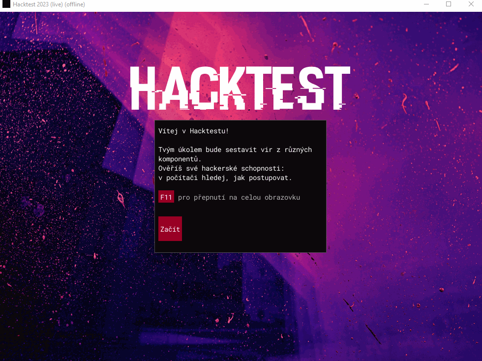

Hacktest 2023.

Potřeboval backend pro uložení postupu účastníků na server. Funkční offline.

## Přihlašovací údaje
- Uživatel: a
- Heslo: qwer

## Vývojáři

- [Niksld](https://github.com/Niksld)
- [Ondrejtra](https://github.com/Ondrejtra)
- [MichaelCZE](https://github.com/MichaelCZE)
- [GrimReapTM](https://github.com/GrimReapTM)

## Minimální požadavky

- OS: Windows 10 nebo novější/Linux
- Disk: 40 MB volného místa
- Internetové připojení: ano

## Spuštění projektu

- Minimální verze Pythonu je 3.10
- Nainstalujte requirements:

```bash
pip install -r requirements.txt
```

- Spustťe hru v offline režimu

```bash
python3 ./src/main.py --offline
```

## Note
Od vydání hry se změnily určité funkce a proto nyní hra __nefunguje__ __ správně__. Tento repozitář slouží pro publikaci soukromého kódu z doby vydání, když hra fungovala správně.

## Zabalení pomocí PyInstalleru

- Balit lze pouze pro ten stejný operační systém, na kterém se skript spustí
- Ve VS Code: `Ctrl` + `Shift` + `B`
- Samostatně:
  - `cd src`
  - `python pyinstaller/release.py`

## Preview

